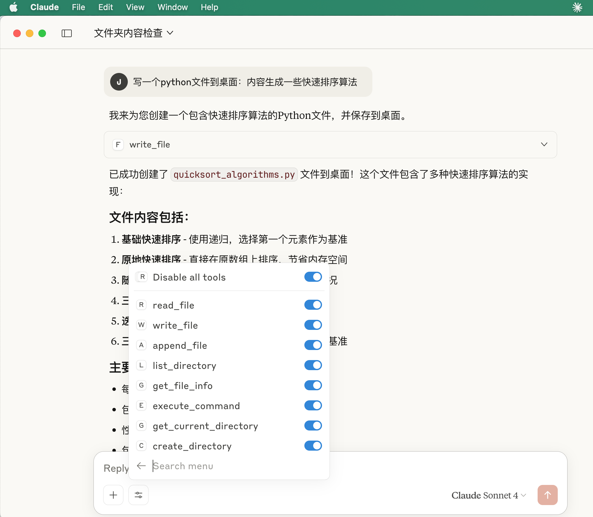
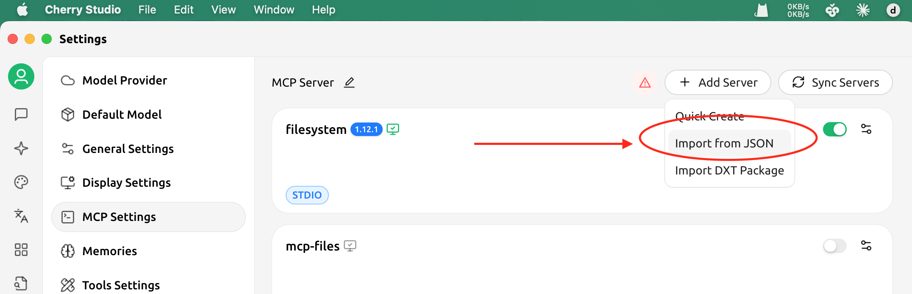
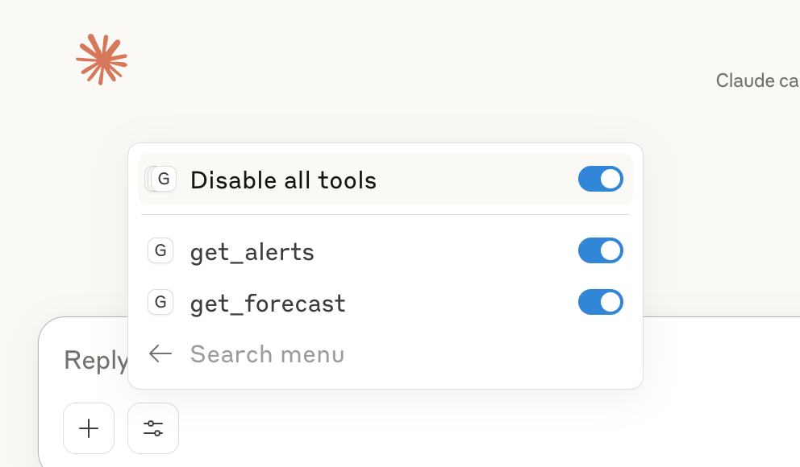

# File System MCP Server




## 1. run mcp server:

```
$ source .venv/bin/activate

$ uv add "mcp[cli]" httpx

$ uv run filesystem.py

## for test
$ echo '{"jsonrpc": "2.0", "id": 1, "method": "initialize", "params": {"protocolVersion": "2024-11-05", "capabilities": {}, "clientInfo": {"name": "test", "version": "1.0"}}}' | uv --directory /Users/clojure/Desktop/filesystem-mcp-server run filesystem.py

{"jsonrpc":"2.0","id":1,"result":{"protocolVersion":"2024-11-05","capabilities":{"experimental":{},"prompts":{"listChanged":false},"resources":{"subscribe":false,"listChanged":false},"tools":{"listChanged":false}},"serverInfo":{"name":"filesystem-command","version":"1.12.1"}}}

```

## 2. config & connect:

* Claude Desktop: /Users/clojure/Library/Application\ Support/Claude/claude_desktop_config.json

```json

{
  "mcpServers": {
    "filesystem": {
      "command": "/Users/clojure/Desktop/filesystem-mcp-server/.venv/bin/python",
      "args": [
        "/Users/clojure/Desktop/filesystem-mcp-server/filesystem.py"
      ]
    }
  }
}

```

change config file , need ` pkill -f "Claude"  ` then restart Claude desktop

* for cherry







